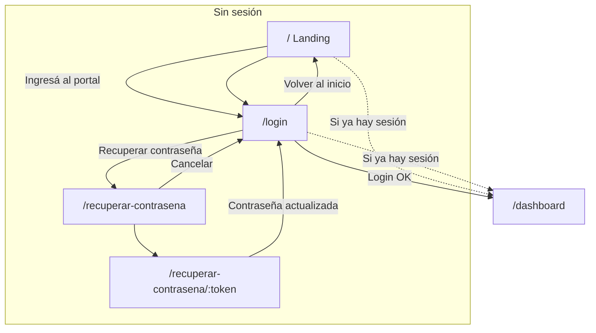
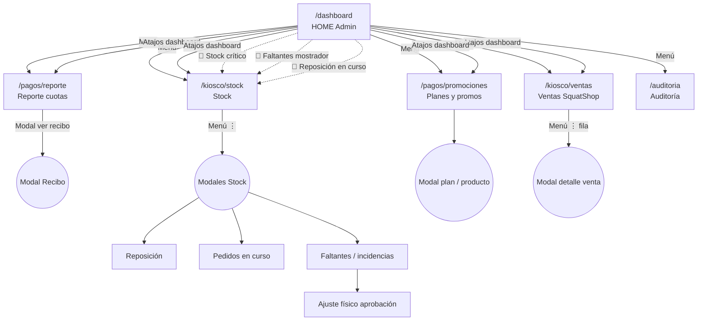
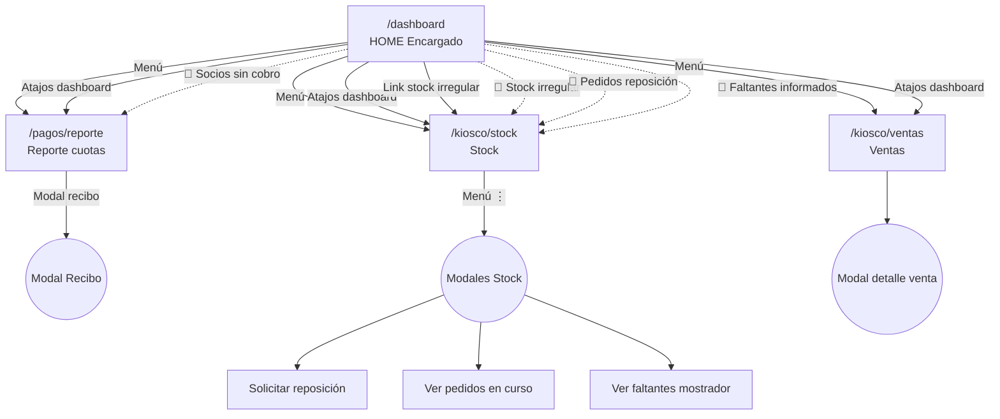
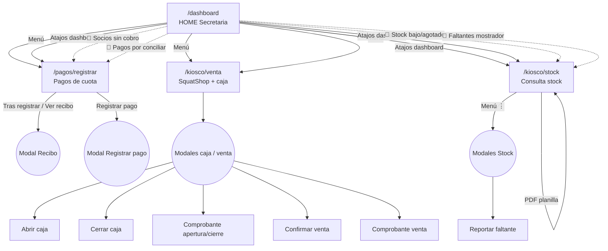
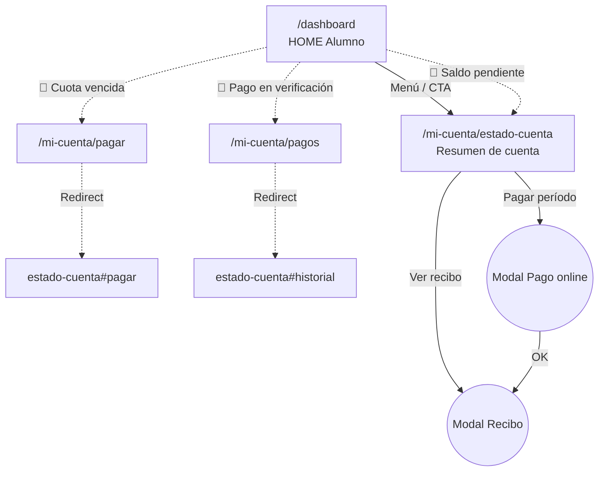
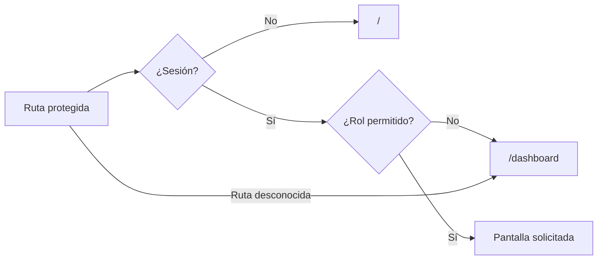

# Mapa de navegación — SquatGym UI

Protótipo front-end (`squatgym-ui`). Fuente: `src/app/routes.jsx`, `src/app/menuConfig.js`, enlaces y alertas en pantallas.

## Leyenda

| Símbolo / estilo | Significado |
|------------------|-------------|
| Línea continua `-->` | Navegación habitual (menú lateral, botón, enlace) |
| Línea punteada `-.->` | Redirección automática o acceso secundario |
| Línea con etiqueta `🔔` | Centro de alertas (campana del header) |
| Nodo `((Modal))` | Pantalla superpuesta **sin cambio de URL** |
| `[/ruta]` | Ruta en el navegador |

---

## Tabla: pantallas por rol

| Ruta | Título | Admin | Encargado | Secretaria | Alumno | Menú lateral |
|------|--------|:-----:|:---------:|:----------:|:------:|:------------:|
| `/` | Landing pública | — | — | — | — | — |
| `/login` | Iniciar sesión | ✓ | ✓ | ✓ | ✓ | — |
| `/recuperar-contrasena` | Recuperar contraseña | ✓ | ✓ | ✓ | ✓ | — |
| `/recuperar-contrasena/:token` | Restablecer contraseña | ✓ | ✓ | ✓ | ✓ | — |
| `/dashboard` | HOME | ✓ | ✓ | ✓ | ✓ | Inicio |
| `/pagos/reporte` | Reporte de cuotas | ✓ | ✓ | — | — | Cuotas y Cobros |
| `/pagos/promociones` | Planes y promociones | ✓ | — | — | — | Planes y Promociones |
| `/pagos/registrar` | Pagos de cuota | — | — | ✓ | — | Registro de Pagos |
| `/pagos/recibo/:id` | Recibo digital (página) | ✓ | ✓ | ✓ | ✓ | — |
| `/kiosco/ventas` | Ventas SquatShop | ✓ | ✓ | — | — | Ventas |
| `/kiosco/stock` | Stock por sucursal | ✓ | ✓ | ✓ | — | Stock / Consulta |
| `/kiosco/venta` | SquatShop ventas (caja) | — | — | ✓ | — | Ventas |
| `/auditoria` | Auditoría | ✓ | — | — | — | Auditoría |
| `/mi-cuenta/estado-cuenta` | Resumen de cuenta | — | — | — | ✓ | Estado de Cuenta |
| `/mi-cuenta/pagar` | — | — | — | — | ✓* | — |
| `/mi-cuenta/pagos` | — | — | — | — | ✓* | — |

\*Redirigen a `/mi-cuenta/estado-cuenta` (anclas `#pagar-desde-app` / `#historial-recibos`).

**Shell común (todos los autenticados):** logo → `/dashboard`; campana → rutas de alertas; cerrar sesión → `/` (sin sesión).

---

## 1. Acceso público y autenticación

---

## 2. Administrador

---

## 3. Encargado de sucursal

---

## 4. Secretaria

---

## 5. Alumno / socio

---

## 6. Reglas globales del router

---

## 7. Modales sin cambio de URL (resumen)

| Pantalla host | Modales |
|---------------|---------|
| `/kiosco/stock` | Pedidos en curso; solicitar reposición; reportar faltante; listado incidencias; ajuste físico (admin) |
| `/kiosco/venta` | Abrir caja; cerrar caja; comprobante caja; confirmar venta; comprobante venta |
| `/kiosco/ventas` | Detalle de venta |
| `/pagos/registrar` | Registrar pago; recibo digital |
| `/mi-cuenta/estado-cuenta` | Pago online; recibo digital |
| `/pagos/promociones` | Alta/edición plan; alta producto kiosco |
| `/pagos/recibo/:id` | Recibo a pantalla completa (mismo componente que el modal; `navigate(-1)` al cerrar) |

---

## Cómo ver los diagramas

- En **GitHub/GitLab**: este `.md` renderiza Mermaid en el visor del repo.
- En **VS Code/Cursor**: extensión “Markdown Preview Mermaid Support”.
- Exportar a PNG/PDF: [mermaid.live](https://mermaid.live) (pegar cada bloque `mermaid`).

---

*Generado para Diseño de Sistemas — TPI SquatGym 2026. Actualizar si cambian `routes.jsx` o `menuConfig.js`.*
