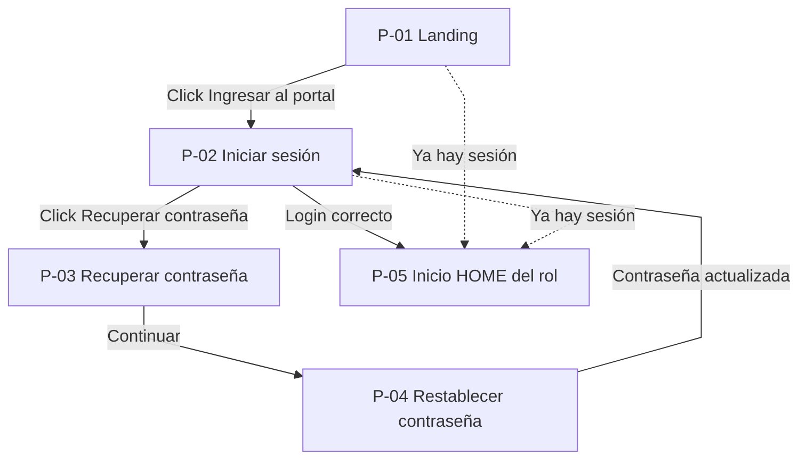
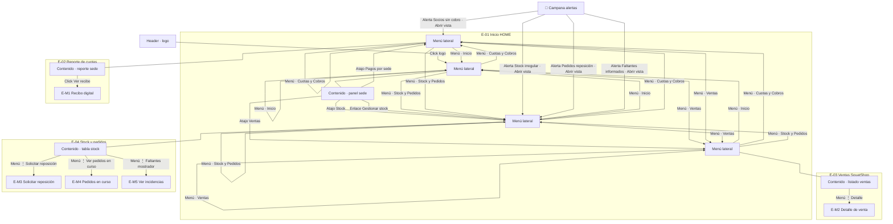
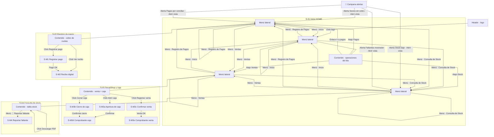
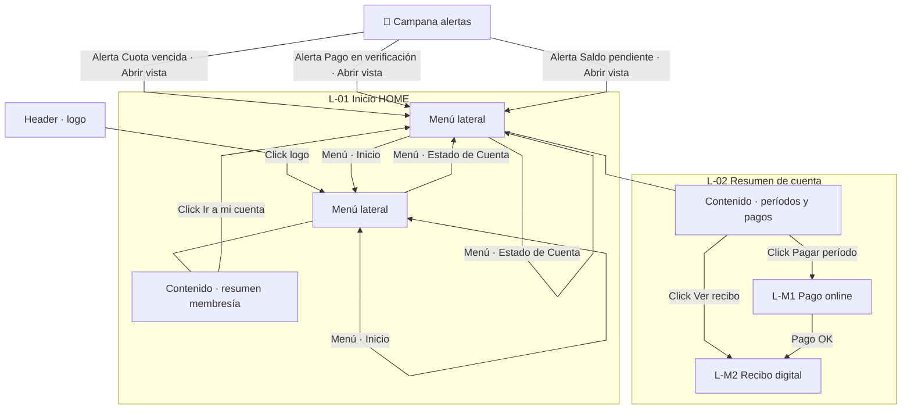

# Diagramas de navegación — SquatGym UI

**Leyenda (todos los diagramas):** nodos = rectángulos · flecha = acción del usuario · `Menú · …` = ítem del menú lateral (válido **desde cualquier pantalla** del rol).

---

## P — Acceso público

---

## A — Administrador

```mermaid
%%{init: {'flowchart': {'curve': 'linear', 'nodeSpacing': 18, 'rankSpacing': 28}}}%%
flowchart TD
  CAMP["🔔 Campana alertas<br/>en todas las pantallas A-01…A-06"]
  HDR["Header · logo SquatGym<br/>en todas las pantallas"]
  HDR -->|Click logo| A01M

  subgraph A01["A-01 Inicio HOME"]
    A01M["Menú lateral"]
    A01C["Contenido · panel institucional"]
    A01M --- A01C
    A01C -->|Atajo Reporte cuotas| A02M
    A01C -->|Atajo Ventas SquatShop| A04M
    A01C -->|Atajo Stock| A05M
    A01C -->|Atajo Precios y promos| A03M
    A01C -->|Enlace Lista precios kiosco| A03M
  end

  subgraph A02["A-02 Reporte de cuotas"]
    A02M["Menú lateral"]
    A02C["Contenido · reporte y filtros"]
    A02M --- A02C
    A02C -->|Click Ver recibo| AM1["A-M1 Recibo digital"]
    A02C -->|Tras registrar pago OK| AM1
  end

  subgraph A03["A-03 Planes y promociones"]
    A03M["Menú lateral"]
    A03C["Contenido · solapas cuotas / promos / kiosco"]
    A03M --- A03C
    A03C -->|Click Nuevo plan| AM7["A-M7 Nuevo plan"]
    A03C -->|Click Nuevo producto| AM8["A-M8 Nuevo producto"]
    A03C -->|Click Nueva promoción| AM9["A-M9 Nueva promoción"]
    A03C -->|Click Editar promoción| AM9
  end

  subgraph A04["A-04 Ventas SquatShop"]
    A04M["Menú lateral"]
    A04C["Contenido · ventas por sede"]
    A04M --- A04C
    A04C -->|Menú ⋮ Detalle| AM2["A-M2 Detalle de venta"]
  end

  subgraph A05["A-05 Stock y pedidos"]
    A05M["Menú lateral"]
    A05C["Contenido · tabla stock"]
    A05M --- A05C
    A05C -->|Menú ⋮ Solicitar reposición| AM3["A-M3 Solicitar reposición"]
    A05C -->|Menú ⋮ Ver pedidos en curso| AM4["A-M4 Pedidos en curso"]
    A05C -->|Menú ⋮ Faltantes mostrador| AM5["A-M5 Lista incidencias"]
    A05C -->|Aprobar ajuste sugerido| AM6["A-M6 Ajuste físico stock"]
    AM5 -->|Click Aprobar ajuste| AM6
  end

  subgraph A06["A-06 Auditoría"]
    A06M["Menú lateral"]
    A06C["Contenido · log auditoría"]
    A06M --- A06C
  end

  A01M -->|Menú · Cuotas y Cobros| A02M
  A01M -->|Menú · Planes y Promociones| A03M
  A01M -->|Menú · Ventas| A04M
  A01M -->|Menú · Stock y Pedidos| A05M
  A01M -->|Menú · Auditoría| A06M

  A02M -->|Menú · Inicio| A01M
  A02M -->|Menú · Cuotas y Cobros| A02M
  A02M -->|Menú · Planes y Promociones| A03M
  A02M -->|Menú · Ventas| A04M
  A02M -->|Menú · Stock y Pedidos| A05M
  A02M -->|Menú · Auditoría| A06M

  A03M -->|Menú · Inicio| A01M
  A03M -->|Menú · Cuotas y Cobros| A02M
  A03M -->|Menú · Planes y Promociones| A03M
  A03M -->|Menú · Ventas| A04M
  A03M -->|Menú · Stock y Pedidos| A05M
  A03M -->|Menú · Auditoría| A06M

  A04M -->|Menú · Inicio| A01M
  A04M -->|Menú · Cuotas y Cobros| A02M
  A04M -->|Menú · Planes y Promociones| A03M
  A04M -->|Menú · Ventas| A04M
  A04M -->|Menú · Stock y Pedidos| A05M
  A04M -->|Menú · Auditoría| A06M

  A05M -->|Menú · Inicio| A01M
  A05M -->|Menú · Cuotas y Cobros| A02M
  A05M -->|Menú · Planes y Promociones| A03M
  A05M -->|Menú · Ventas| A04M
  A05M -->|Menú · Stock y Pedidos| A05M
  A05M -->|Menú · Auditoría| A06M

  A06M -->|Menú · Inicio| A01M
  A06M -->|Menú · Cuotas y Cobros| A02M
  A06M -->|Menú · Planes y Promociones| A03M
  A06M -->|Menú · Ventas| A04M
  A06M -->|Menú · Stock y Pedidos| A05M
  A06M -->|Menú · Auditoría| A06M

  CAMP -->|Alerta Stock crítico · Abrir vista| A05M
  CAMP -->|Alerta Faltantes mostrador · Abrir vista| A05M
  CAMP -->|Alerta Reposición en curso · Abrir vista| A05M
```

*Desde A-02, A-05, etc. las mismas flechas `Menú · …` permiten ir a cualquier otra pantalla (no hace falta volver a A-01).*

---

## E — Encargado

---

## S — Secretaria

---

## L — Alumno

---

## Índice numérico rápido

| Rol | Pantallas | Modales |
|-----|-----------|---------|
| P | P-01 … P-05 | — |
| A | A-01 … A-06 | A-M1 … A-M9 |
| E | E-01 … E-04 | E-M1 … E-M5 |
| S | S-01 … S-04 | S-M1 … S-M4, S-M3a…e |
| L | L-01 … L-02 | L-M1 … L-M2 |

---

*Exportar: [mermaid.live](https://mermaid.live) · Curva **linear** o **step** si el renderizador curva demasiado.*
