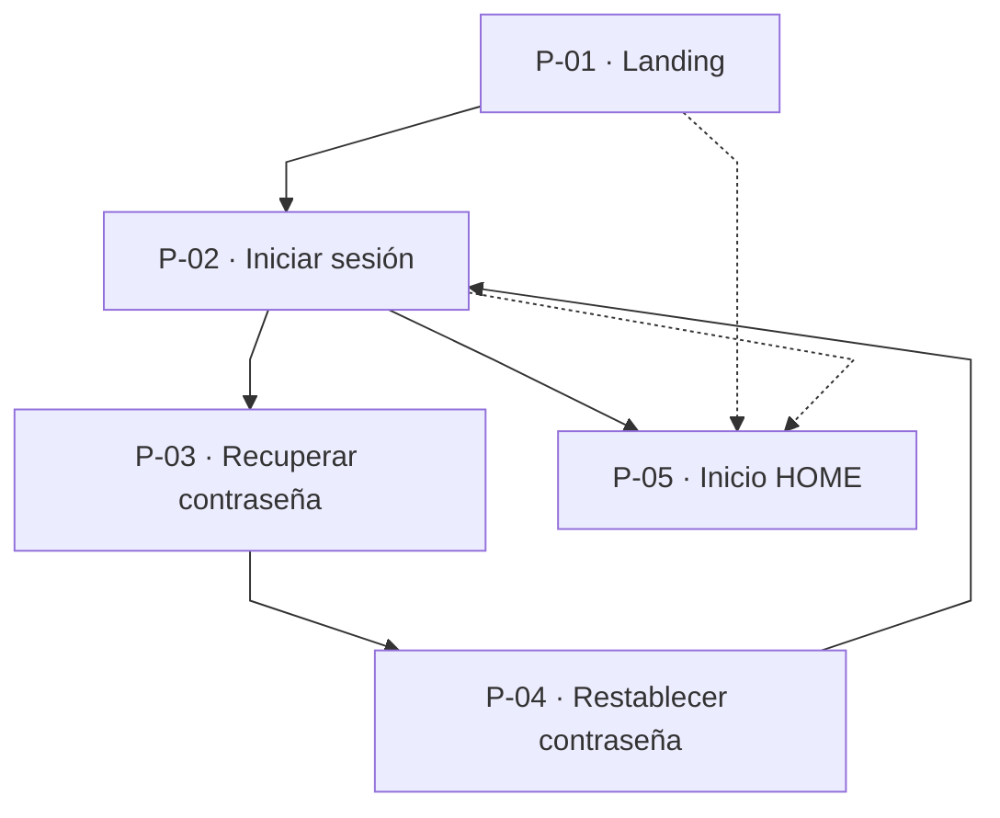
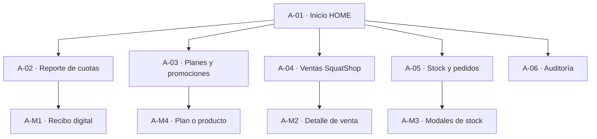
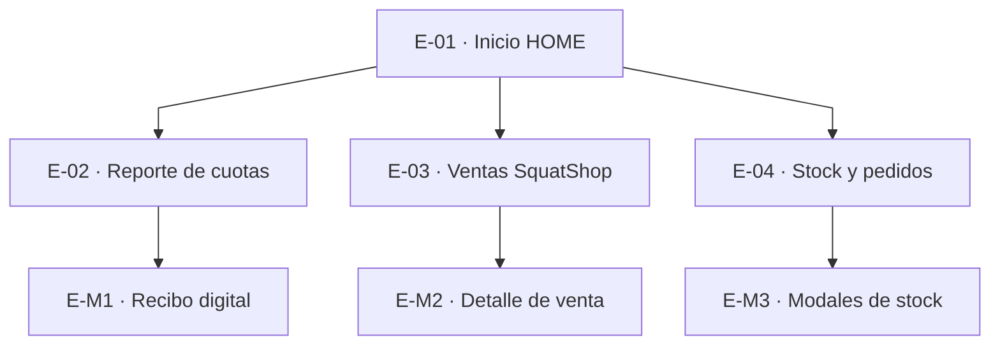
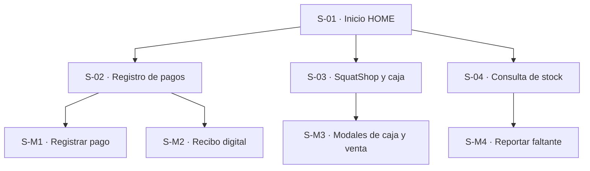
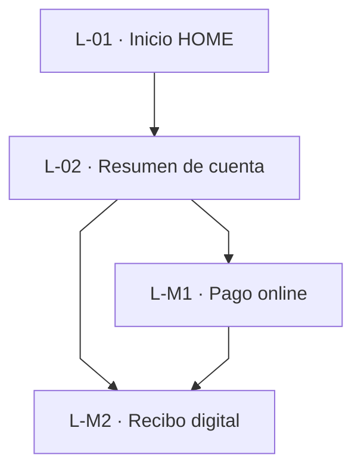
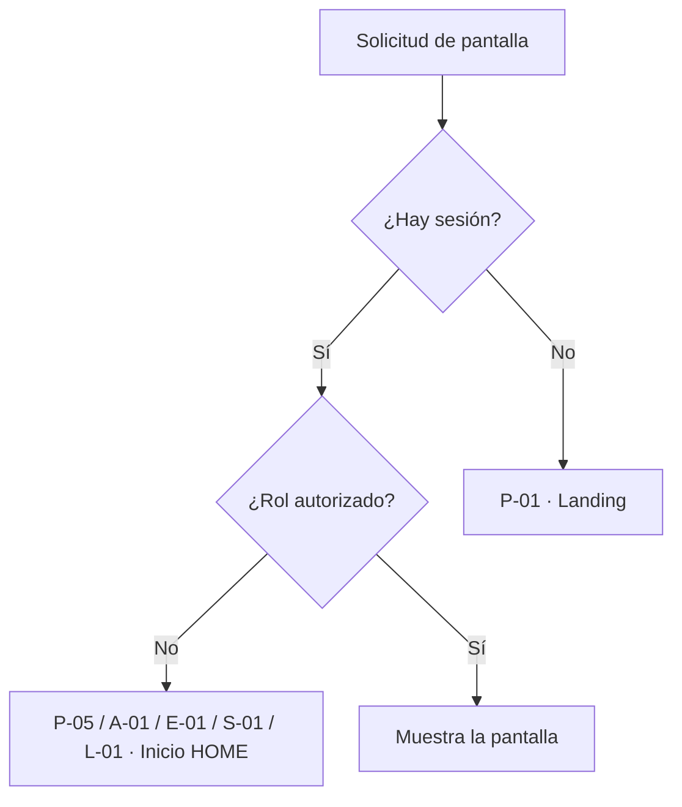

# Mapa de navegación — SquatGym UI

Protótipo front-end. Cada rol tiene su **numeración propia** (no se comparte entre roles).

## Leyenda

| Símbolo | Significado |
|---------|-------------|
| `──►` en diagrama | Menú lateral, botón o enlace en pantalla |
| `┄┄►` en diagrama | Redirección automática |
| `🔔` | Acceso desde centro de alertas (header) |
| **M-xx** | Modal (misma pantalla, sin cambio de vista principal) |

**Diagramas:** líneas rectas (`curve: linear`) y un solo nivel desde **Inicio** para evitar cruces.

---

## Catálogo — Acceso público (P)

| Nº | Pantalla |
|----|----------|
| P-01 | Landing SquatGym |
| P-02 | Iniciar sesión |
| P-03 | Recuperar contraseña |
| P-04 | Restablecer contraseña |
| P-05 | Inicio HOME *(tras login, cualquier rol)* |

---

## Catálogo — Administrador (A)

| Nº | Pantalla | Menú lateral |
|----|----------|:------------:|
| A-01 | Inicio HOME | ✓ Inicio |
| A-02 | Reporte de cuotas por sucursal | ✓ Cuotas y Cobros |
| A-03 | Planes, cuotas y promociones | ✓ Planes y Promociones |
| A-04 | Ventas SquatShop por sucursal | ✓ Ventas |
| A-05 | Stock y pedidos por sucursal | ✓ Stock y Pedidos |
| A-06 | Auditoría del sistema | ✓ Auditoría |
| A-M1 | Recibo digital *(modal)* | — |
| A-M2 | Detalle de venta *(modal)* | — |
| A-M3 | Gestión stock: reposición, pedidos, faltantes, ajuste *(modales)* | — |
| A-M4 | Alta/edición plan o producto kiosco *(modal)* | — |

**Alertas 🔔 desde A-01:** Stock crítico → A-05 · Faltantes mostrador → A-05 · Reposición en curso → A-05

---

## Catálogo — Encargado (E)

| Nº | Pantalla | Menú lateral |
|----|----------|:------------:|
| E-01 | Inicio HOME | ✓ Inicio |
| E-02 | Reporte de cuotas por sucursal | ✓ Cuotas y Cobros |
| E-03 | Ventas SquatShop por sucursal | ✓ Ventas |
| E-04 | Stock y pedidos por sucursal | ✓ Stock y Pedidos |
| E-M1 | Recibo digital *(modal)* | — |
| E-M2 | Detalle de venta *(modal)* | — |
| E-M3 | Gestión stock: reposición, pedidos, ver faltantes *(modales)* | — |

**Alertas 🔔 desde E-01:** Socios sin cobro → E-02 · Stock irregular → E-04 · Pedidos reposición → E-04 · Faltantes informados → E-04

---

## Catálogo — Secretaria (S)

| Nº | Pantalla | Menú lateral |
|----|----------|:------------:|
| S-01 | Inicio HOME | ✓ Inicio |
| S-02 | Registro de pagos de cuota | ✓ Registro de Pagos |
| S-03 | SquatShop — ventas y caja | ✓ Ventas |
| S-04 | Consulta de stock | ✓ Consulta de Stock |
| S-M1 | Registrar pago *(modal)* | — |
| S-M2 | Recibo digital *(modal)* | — |
| S-M3 | Caja: abrir, cerrar, comprobantes, confirmar venta *(modales)* | — |
| S-M4 | Stock: reportar faltante *(modal)* | — |

**Alertas 🔔 desde S-01:** Socios sin cobro → S-02 · Pagos por conciliar → S-02 · Stock bajo/agotado → S-04 · Faltantes mostrador → S-04

**En S-04:** exportar planilla PDF (misma pantalla, sin nueva numeración).

---

## Catálogo — Alumno (L)

| Nº | Pantalla | Menú lateral |
|----|----------|:------------:|
| L-01 | Inicio HOME | ✓ Inicio |
| L-02 | Resumen de cuenta y pagos | ✓ Estado de Cuenta |
| L-M1 | Pago online *(modal)* | — |
| L-M2 | Recibo digital *(modal)* | — |

**Alertas 🔔 desde L-01:** Cuota vencida → L-02 (sección pagar) · Pago en verificación → L-02 (historial) · Saldo pendiente → L-02

*(Las entradas “Pagar cuota” y “Recibos” del menú antiguo redirigen al resumen L-02.)*

---

## 1. Acceso público (P-01 a P-05)

---

## 2. Administrador (A-01 a A-06)

*Atajos en A-01 y alertas 🔔 apuntan a las mismas pantallas A-02 … A-06 (ver catálogo).*

---

## 3. Encargado (E-01 a E-04)

---

## 4. Secretaria (S-01 a S-04)

---

## 5. Alumno (L-01 a L-02)

*Alertas 🔔 desde L-01 llevan a L-02 (pestaña o sección según el tipo de aviso).*

---

## 6. Reglas de acceso (todas las pantallas internas)

---

## Detalle de modales (referencia)

| Host | Modales |
|------|---------|
| A-05 / E-04 / S-04 · Stock | Pedidos en curso · Solicitar reposición · Reportar faltante · Incidencias · Ajuste físico *(solo admin)* |
| S-03 · SquatShop y caja | Abrir caja · Cerrar caja · Comprobante caja · Confirmar venta · Comprobante venta |
| A-04 / E-03 · Ventas | Detalle de venta |
| S-02 · Registro de pagos | Registrar pago · Recibo digital |
| L-02 · Resumen de cuenta | Pago online · Recibo digital |
| A-03 · Promociones | Plan · Producto kiosco |

---

## Cómo ver y exportar

- **Preview:** VS Code/Cursor con soporte Mermaid, o GitHub/GitLab.
- **PNG/PDF:** [mermaid.live](https://mermaid.live) — pegar un bloque `mermaid` a la vez.
- Si aún se ven curvas: en mermaid.live, *Configuration* → *Flowchart* → **Curve** = `linear` o `step`.

---

*Diseño de Sistemas — TPI SquatGym 2026. Numeración y nombres alineados a `routes.jsx` y `menuConfig.js`.*
