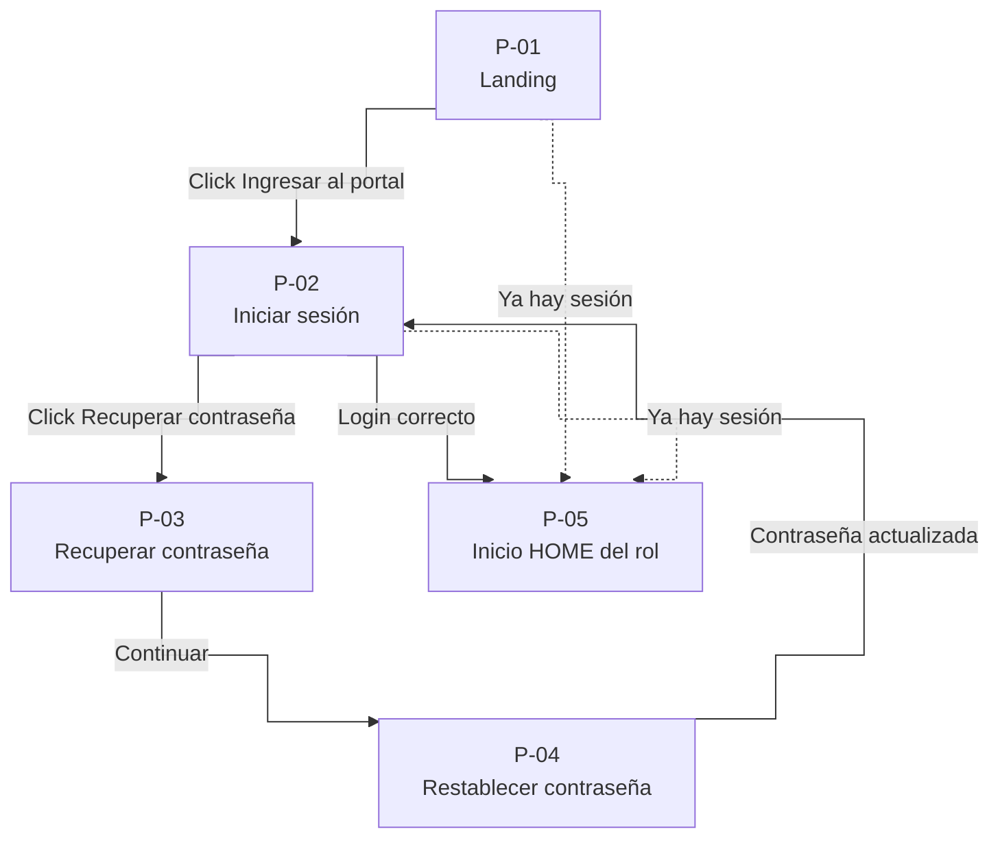
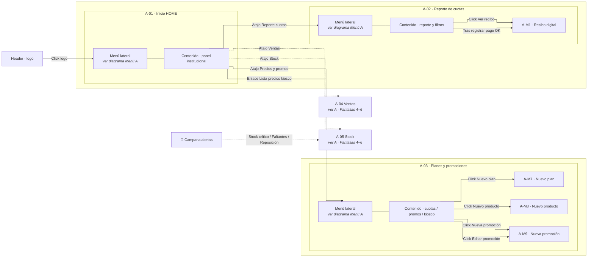
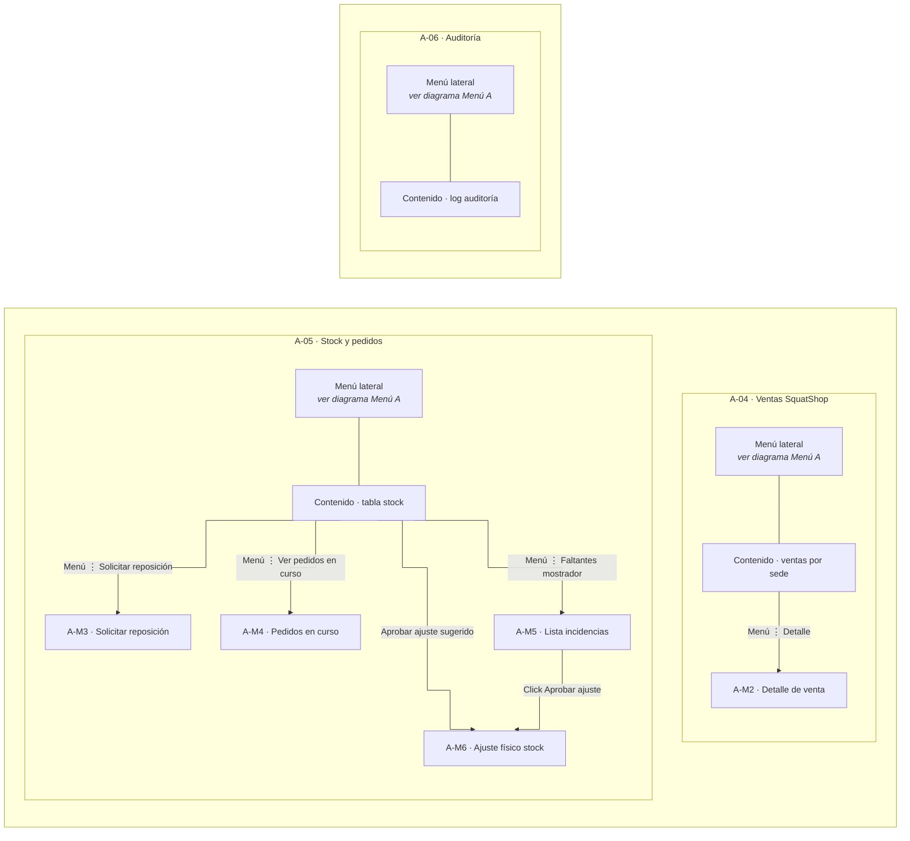
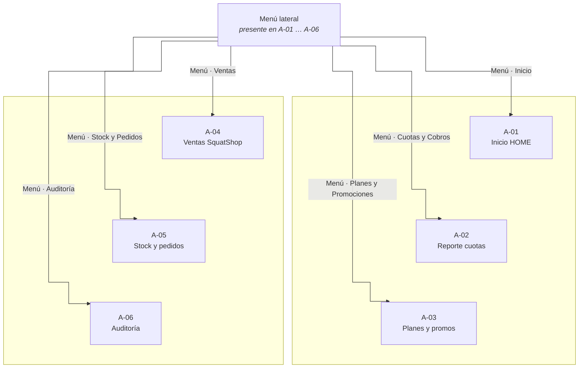
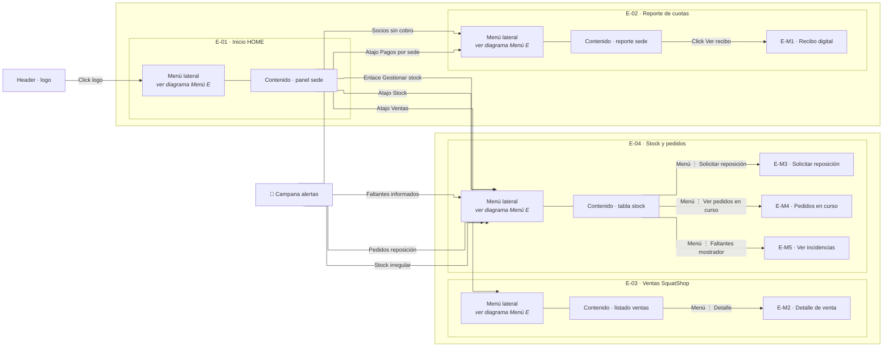
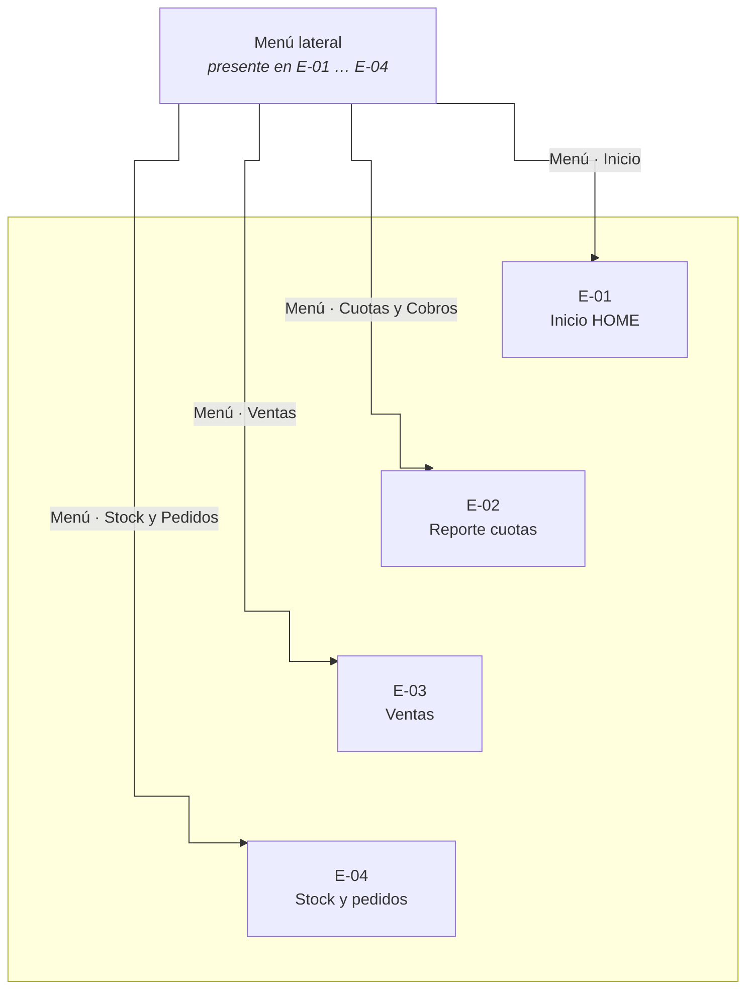
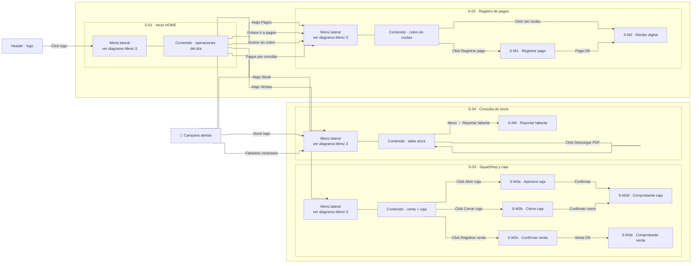
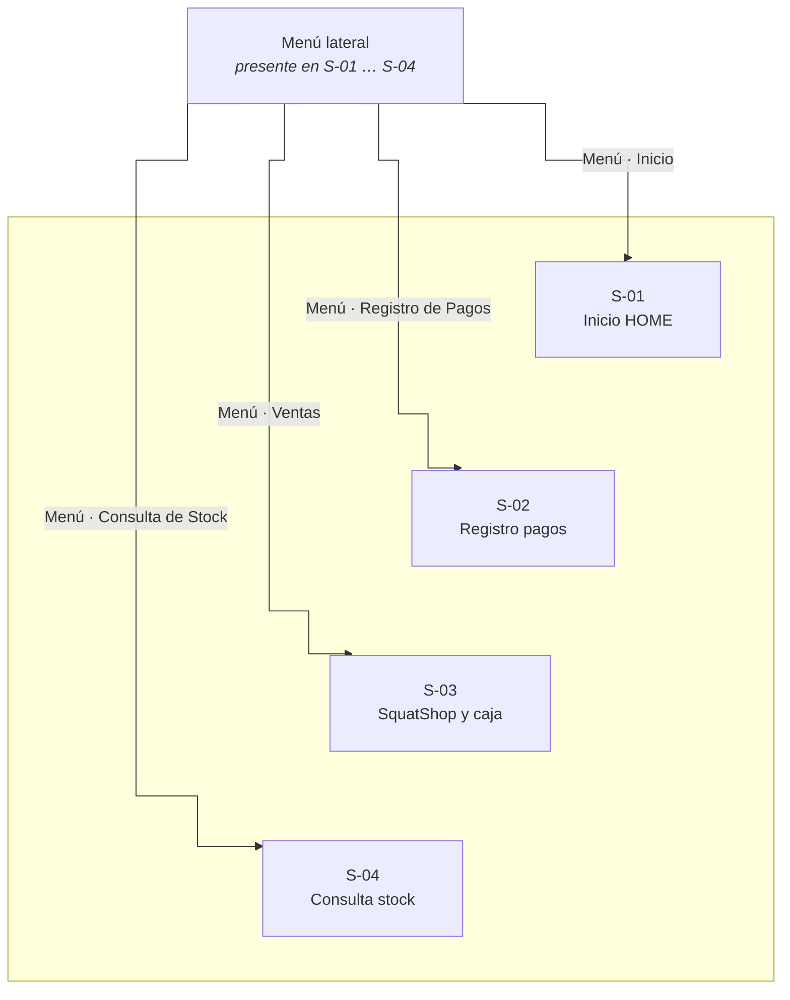
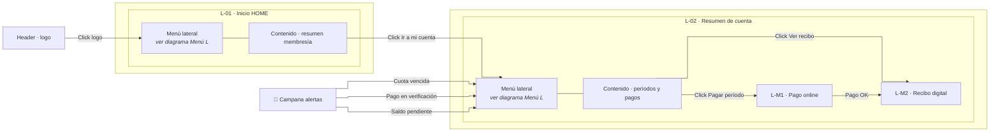
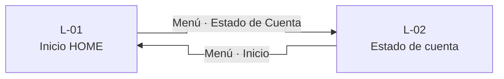

# Diagramas de navegación — SquatGym UI

**Leyenda:** rectángulos = pantallas, menú, contenido o modales · flecha = acción del usuario · `Menú · …` = ítem del menú lateral.

**Cómo leer sin solapamientos:** cada rol tiene **varios diagramas** (pantallas + menú aparte). En [mermaid.live](https://mermaid.live) pegá un bloque, usá **curva step** y exportá a PNG con zoom **150–200 %**.

---

## P — Acceso público

---

## A — Administrador

### A · Pantallas 1–3 (Inicio, Cuotas, Planes)

### A · Pantallas 4–6 (Ventas, Stock, Auditoría)

### A · Menú lateral (desde cualquier pantalla A-01 … A-06)

*El bloque «Menú lateral» es idéntico en todas las pantallas; desde cualquiera podés ir a las demás con los ítems listados.*

*Líneas gruesas `~~~`: pantallas del mismo rol; el menú conecta **cualquiera → cualquiera** (no hace falta volver a A-01).*

---

## E — Encargado

### E · Pantallas y modales

### E · Menú lateral (desde cualquier pantalla E-01 … E-04)

---

## S — Secretaria

### S · Pantallas y modales

### S · Menú lateral (desde cualquier pantalla S-01 … S-04)

---

## L — Alumno

### L · Pantallas y modales

### L · Menú lateral (desde cualquier pantalla L-01 … L-02)

---

## Índice numérico rápido

| Rol | Pantallas | Modales |
|-----|-----------|---------|
| P | P-01 … P-05 | — |
| A | A-01 … A-06 | A-M1 … A-M9 |
| E | E-01 … E-04 | E-M1 … E-M5 |
| S | S-01 … S-04 | S-M1 … S-M4, S-M3a…e |
| L | L-01 … L-02 | L-M1 … L-M2 |

---

*Exportar: [mermaid.live](https://mermaid.live) · Curva **step** · Zoom **150–200 %** al exportar PNG.*
