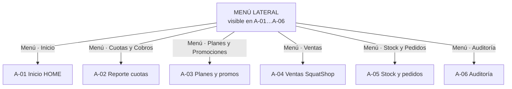
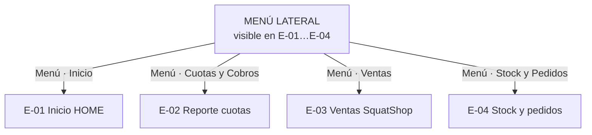
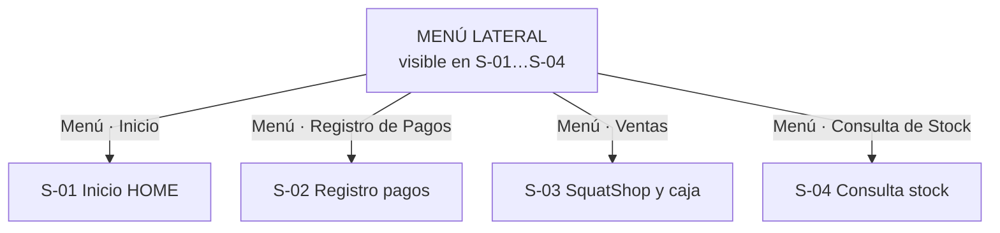
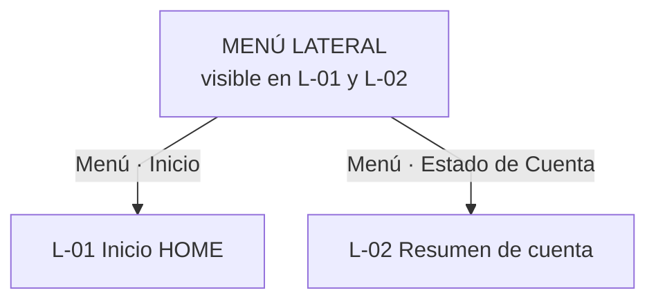
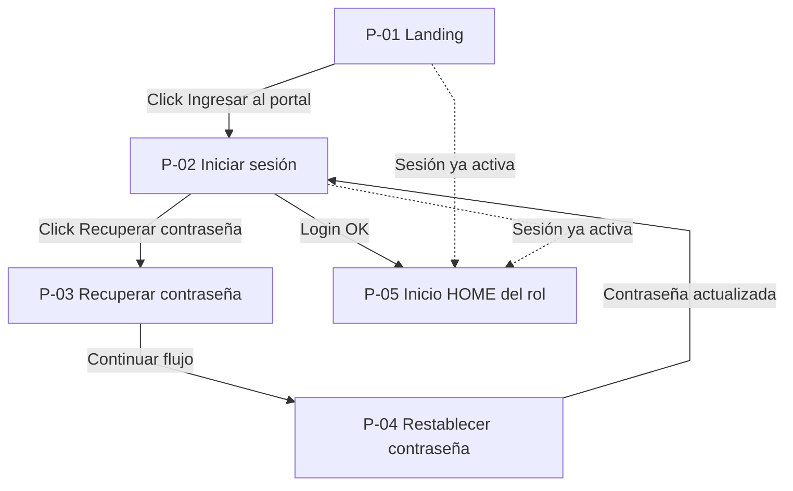

# Mapa de navegación — SquatGym UI

Documento para **Diseño de Sistemas**. Refleja el prototipo real (`routes.jsx`, `menuConfig.js`, dashboards y alertas).

---

## Cómo leer este mapa (3 canales)

| Canal | Dónde está | Comportamiento |
|-------|------------|----------------|
| **1 · Menú lateral** | Barra izquierda (siempre en pantallas internas) | Desde **cualquier pantalla** del rol podés ir a **cualquier otra** del menú. Es el direccionamiento principal. |
| **2 · Atajos en HOME** | Botones y enlaces en la pantalla Inicio | Solo cuando estás en **Inicio (HOME)**. Atajos rápidos a tareas frecuentes. |
| **3 · Alertas** | Campana del header | Desde **cualquier pantalla**. Click en una alerta → abre la pantalla indicada. |
| **4 · En la pantalla** | Botones, tablas, menú ⋮ | Modales y acciones locales; **no cambian** la pantalla principal (salvo recibo en página completa). |

**Formas en diagramas:** todos los nodos son **rectángulos** (misma figura). No hay significado distinto por forma.

**Numeración:** cada rol tiene su propia serie (**A**, **E**, **S**, **L**, **P**). No se comparten entre roles.

---

## Índice de pantallas

### Público (P)

| Nº | Pantalla |
|----|----------|
| P-01 | Landing SquatGym |
| P-02 | Iniciar sesión |
| P-03 | Recuperar contraseña |
| P-04 | Restablecer contraseña |
| P-05 | Inicio HOME *(primer pantalla tras login)* |

### Administrador (A)

| Nº | Pantalla |
|----|----------|
| A-01 | Inicio HOME |
| A-02 | Reporte de cuotas por sucursal |
| A-03 | Planes, cuotas y promociones |
| A-04 | Ventas SquatShop por sucursal |
| A-05 | Stock y pedidos por sucursal |
| A-06 | Auditoría del sistema |

### Encargado (E)

| Nº | Pantalla |
|----|----------|
| E-01 | Inicio HOME |
| E-02 | Reporte de cuotas por sucursal |
| E-03 | Ventas SquatShop por sucursal |
| E-04 | Stock y pedidos por sucursal |

### Secretaria (S)

| Nº | Pantalla |
|----|----------|
| S-01 | Inicio HOME |
| S-02 | Registro de pagos de cuota |
| S-03 | SquatShop — ventas y caja |
| S-04 | Consulta de stock |

### Alumno (L)

| Nº | Pantalla |
|----|----------|
| L-01 | Inicio HOME |
| L-02 | Resumen de cuenta y pagos |

---

## Globales (todos los roles autenticados)

| Desde | Acción | Hacia |
|-------|--------|-------|
| Cualquier pantalla interna | Click logo **SquatGym** (header) | Inicio HOME del rol |
| Cualquier pantalla interna | Click ítem del **menú lateral** | Pantalla del ítem (ver tablas por rol) |
| Cualquier pantalla interna | Click campana → elegir alerta → **Abrir vista** | Pantalla de la alerta (ver tablas por rol) |
| Cualquier pantalla interna | Menú usuario → **Cerrar sesión** | P-01 Landing |

---

# ADMINISTRADOR

## A · Menú lateral *(desde cualquier pantalla A-01 … A-06)*

El menú es el eje: no hace falta pasar por HOME.

| Acción en el menú | Pantalla destino |
|-------------------|------------------|
| Click **Inicio** | A-01 Inicio HOME |
| Click **Cuotas y Cobros** | A-02 Reporte de cuotas |
| Click **Planes y Promociones** | A-03 Planes y promociones |
| Click **Ventas** | A-04 Ventas SquatShop |
| Click **Stock y Pedidos** | A-05 Stock y pedidos |
| Click **Auditoría** | A-06 Auditoría |



*Cualquier flecha del menú se puede usar estando en A-02, A-05, etc.; el diagrama muestra destinos, no un recorrido obligatorio desde HOME.*

## A · Atajos solo en HOME (A-01)

| Desde | Acción | Hacia |
|-------|--------|-------|
| A-01 | Click botón **Reporte cuotas** | A-02 |
| A-01 | Click botón **Ventas SquatShop** | A-04 |
| A-01 | Click botón **Stock** | A-05 |
| A-01 | Click botón **Precios y promos** | A-03 |
| A-01 | Click enlace **Lista de precios kiosco** (tarjeta SquatShop) | A-03 |

## A · Alertas (desde cualquier pantalla)

| Desde | Acción | Hacia |
|-------|--------|-------|
| * | Alerta **Stock crítico en la red** → Abrir vista | A-05 |
| * | Alerta **Faltantes de mostrador** → Abrir vista | A-05 |
| * | Alerta **Reposición en curso** → Abrir vista | A-05 |

## A · Dentro de pantalla (modales y enlaces)

| Desde | Acción | Hacia |
|-------|--------|-------|
| A-02 | Click **Ver recibo** (tabla de pagos) | Modal Recibo digital |
| A-02 | Tras **Registrar pago** exitoso | Modal Recibo digital |
| A-03 | Click **Nuevo plan** / editar plan | Modal Plan |
| A-03 | Click **Nuevo producto** kiosco | Modal Producto |
| A-04 | Menú ⋮ fila → **Detalle** | Modal Detalle de venta |
| A-05 | Menú ⋮ → **Solicitar reposición** | Modal Reposición |
| A-05 | Menú ⋮ → **Ver pedidos en curso** | Modal Pedidos en curso |
| A-05 | Menú ⋮ → **Faltantes mostrador** | Modal Lista incidencias |
| A-05 | Modal incidencias → **Aprobar ajuste sugerido** | Modal Ajuste físico stock |

---

# ENCARGADO

## E · Menú lateral *(desde cualquier pantalla E-01 … E-04)*

| Acción en el menú | Pantalla destino |
|-------------------|------------------|
| Click **Inicio** | E-01 Inicio HOME |
| Click **Cuotas y Cobros** | E-02 Reporte de cuotas |
| Click **Ventas** | E-03 Ventas SquatShop |
| Click **Stock y Pedidos** | E-04 Stock y pedidos |



## E · Atajos solo en HOME (E-01)

| Desde | Acción | Hacia |
|-------|--------|-------|
| E-01 | Click botón **Stock** | E-04 |
| E-01 | Click botón **Ventas** | E-03 |
| E-01 | Click botón **Pagos por sede** | E-02 |
| E-01 | Click enlace **Gestionar** (tarjeta alertas de stock) | E-04 |

## E · Alertas (desde cualquier pantalla)

| Desde | Acción | Hacia |
|-------|--------|-------|
| * | Alerta **Socios sin cobro este mes** → Abrir vista | E-02 |
| * | Alerta **Stock irregular** → Abrir vista | E-04 |
| * | Alerta **Pedidos de reposición** → Abrir vista | E-04 |
| * | Alerta **Faltantes informados** → Abrir vista | E-04 |

## E · Dentro de pantalla

| Desde | Acción | Hacia |
|-------|--------|-------|
| E-02 | Click **Ver recibo** | Modal Recibo digital |
| E-03 | Menú ⋮ → **Detalle** | Modal Detalle de venta |
| E-04 | Menú ⋮ → **Solicitar reposición** | Modal Reposición |
| E-04 | Menú ⋮ → **Ver pedidos en curso** | Modal Pedidos en curso |
| E-04 | Menú ⋮ → **Faltantes mostrador** | Modal Ver faltantes *(solo consulta; cierre lo hace admin)* |

---

# SECRETARIA

## S · Menú lateral *(desde cualquier pantalla S-01 … S-04)*

| Acción en el menú | Pantalla destino |
|-------------------|------------------|
| Click **Inicio** | S-01 Inicio HOME |
| Click **Registro de Pagos** | S-02 Registro de pagos |
| Click **Ventas** | S-03 SquatShop y caja |
| Click **Consulta de Stock** | S-04 Consulta de stock |



## S · Atajos solo en HOME (S-01)

| Desde | Acción | Hacia |
|-------|--------|-------|
| S-01 | Click botón **Pagos** | S-02 |
| S-01 | Click botón **Ventas** | S-03 |
| S-01 | Click botón **Stock** | S-04 |
| S-01 | Click enlace **Ir a pagos** (tarjeta acreditación pendiente) | S-02 |

## S · Alertas (desde cualquier pantalla)

| Desde | Acción | Hacia |
|-------|--------|-------|
| * | Alerta **Socios sin cobro este mes** → Abrir vista | S-02 |
| * | Alerta **Pagos por conciliar** → Abrir vista | S-02 |
| * | Alerta **Stock bajo o agotado** → Abrir vista | S-04 |
| * | Alerta **Faltantes en mostrador** → Abrir vista | S-04 |

## S · Dentro de pantalla

| Desde | Acción | Hacia |
|-------|--------|-------|
| S-02 | Click **Registrar pago** (con períodos elegidos) | Modal Registrar pago |
| S-02 | Click **Ver recibo** / tras cobro exitoso | Modal Recibo digital |
| S-03 | Click **Abrir caja** | Modal Apertura de caja |
| S-03 | Click **Cerrar caja** | Modal Cierre de caja |
| S-03 | Tras cierre/apertura | Modal Comprobante de caja |
| S-03 | Click **Registrar venta** | Modal Confirmar venta → Modal Comprobante venta |
| S-04 | Click **Descargar PDF** | Misma pantalla (impresión planilla) |
| S-04 | Menú ⋮ → **Reportar faltante (mostrador)** | Modal Reportar faltante |

---

# ALUMNO

## L · Menú lateral *(desde cualquier pantalla L-01 o L-02)*

| Acción en el menú | Pantalla destino |
|-------------------|------------------|
| Click **Inicio** | L-01 Inicio HOME |
| Click **Estado de Cuenta** | L-02 Resumen de cuenta |



## L · Atajos solo en HOME (L-01)

| Desde | Acción | Hacia |
|-------|--------|-------|
| L-01 | Click **Ir a mi cuenta** | L-02 |

## L · Alertas (desde cualquier pantalla)

| Desde | Acción | Hacia |
|-------|--------|-------|
| * | Alerta **Cuota vencida** → Abrir vista | L-02 *(sección pagar)* |
| * | Alerta **Pago en verificación** → Abrir vista | L-02 *(historial)* |
| * | Alerta **Saldo pendiente** → Abrir vista | L-02 |

*Rutas legacy `/mi-cuenta/pagar` y `/mi-cuenta/pagos` redirigen automáticamente a L-02.*

## L · Dentro de pantalla

| Desde | Acción | Hacia |
|-------|--------|-------|
| L-02 | Click **Pagar** (período) | Modal Pago online |
| L-02 | Click **Ver recibo** / tras pago OK | Modal Recibo digital |

---

# ACCESO PÚBLICO (antes del menú)

| Desde | Acción | Hacia |
|-------|--------|-------|
| P-01 | Click **Ingresá al portal** / **Iniciar sesión** | P-02 |
| P-02 | Login correcto | P-05 Inicio HOME del rol |
| P-02 | Click **Recuperar contraseña** | P-03 |
| P-03 | Enviar / continuar flujo | P-04 |
| P-04 | Contraseña actualizada | P-02 |
| P-01 o P-02 | Ya hay sesión activa *(automático)* | P-05 |



---

# Reglas del sistema (acceso denegado)

| Desde | Acción | Hacia |
|-------|--------|-------|
| Pantalla protegida sin sesión | Automático | P-01 Landing |
| Pantalla de otro rol | Automático | Inicio HOME del rol |
| Ruta inexistente | Automático | Inicio HOME del rol |

---

## Resumen visual del modelo mental

```
                    ┌─────────────────┐
                    │  MENÚ LATERAL   │  ← principal: desde CUALQUIER pantalla
                    └────────┬────────┘
           ┌─────────────────┼─────────────────┐
           ▼                 ▼                 ▼
      Pantalla A        Pantalla B        Pantalla C
           │                 │                 │
           │  (solo en HOME)   │                 │
           └──── atajos ───────┘                 │
                                                 │
      Campana alertas ──── click alerta ─────────┘
      (desde cualquier pantalla)
```

---

## Exportar diagramas

- Vista previa: Markdown con Mermaid en VS Code/Cursor o GitHub.
- PNG/PDF: [mermaid.live](https://mermaid.live) — un diagrama por vez; curva **linear** o **step**.

---

*SquatGym UI · TPI Diseño de Sistemas 2026*
